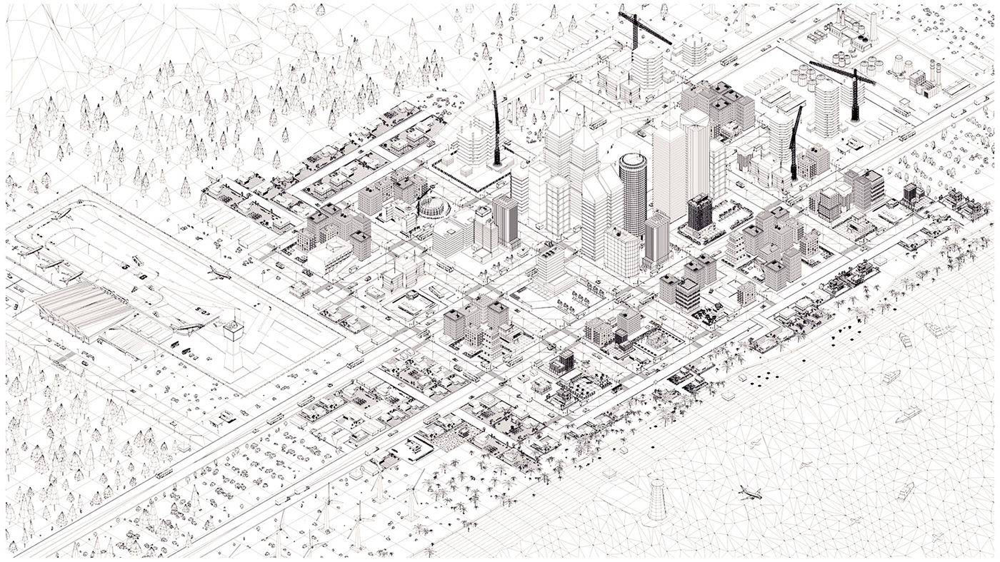
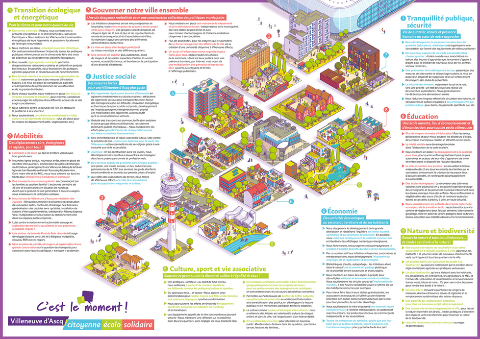
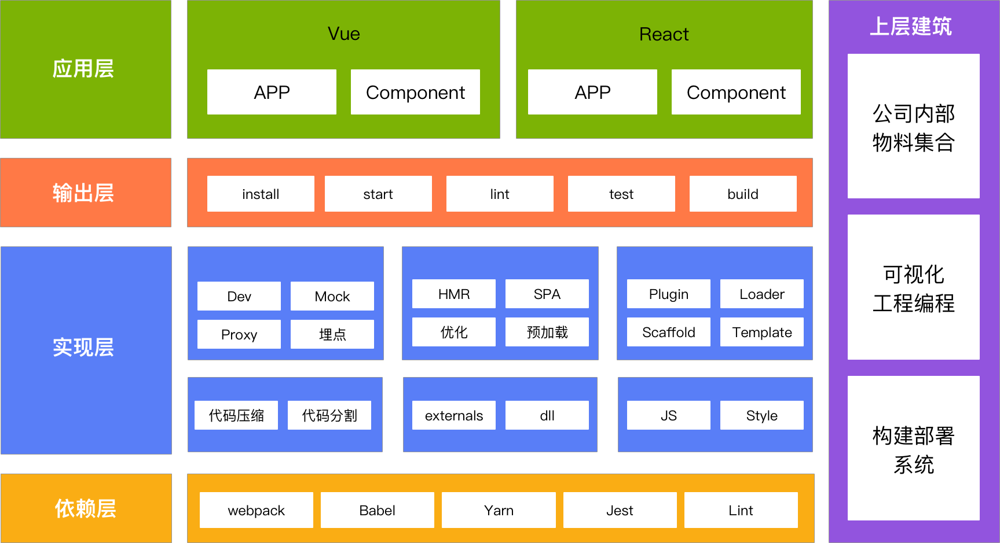

# 「 微前端 」预备篇

<small>[@LE](https://github.com/leer0911/)</small>

--

<small>vv FE，👨‍💻👩‍💼👦</small>

Note:
先简单地做个自我介绍，我从 16 年正式开始进入前端领域，那年是我第一次参加福建前端联盟，还记得那年分享的主题是 Vue，陪伴至今，认识了很多小伙伴，这是我在群里的头像，目前在微微科技做前端，兼职 HR。

--

## 概要

- 什么是微前端 😑
- 真的需要它吗 🤔
- 怎么才能落地 🧐

Note:
今天分享的主题是微前端，主要围绕这三个问题，第一，什么是微前端；第二，真的需要它吗；第三，怎么才能落地。微前端涵盖了很多的内容，本次分享的目的是让大家对微前端有个基本的认识，最终可以根据自己公司业务场景制定一个大致的微前端落地方案。

---

## 什么是微前端 😑

--

Techniques, strategies and recipes for building a modern web app with<strong> multiple teams</strong> using <strong>different JavaScript frameworks</strong>. —— Micro Frontends

Note:
我们先来看下官方对微前端的定义，主要有两个关键的部分，multiple teams 和 different frameworks，大概意思就是，不同团队可以用不同的技术栈来构建同一个应用。不过，对于团队内部是否要使用不同的技术栈，我个人也是打问号的，但技术栈无关确实是微前端衡量标准和一大亮点。加上前端技术栈的更新速度，很难保证 2 年后，现在的技术是否难满足那时的需求。

--

Note:
用一张图来表示的话，微前端就是将后端微服务的理念应用于浏览器端。其目的在于，把一个单体应用拆分多个小型应用且技术栈无关。也就是说，我们可以用 React、Vue、Angular 来搭建不同的应用，最后聚合在同一个应用里。之所以有会这种分治的思想，原因在于 Web 应用正在变得越来越庞大。

--

### 前端架构演进

Note:
前端作为产品快速响应方，其架构也在过去几年里，发生了巨大的变化。从最初的寄生于服务端模板渲染到 JQ 多页时代，发展成 React、Vue、Angular 等现代框架支撑的单页应用模式，以及今天讲的微前端模式。微前端是 thoughtworks 在 2016 年提出来，并开启了前端分治时代的大门。不过，目前大部分应用仍处于单页模式，并且多数为生命周期较长的单体应用。

--

### 所谓的单体应用就是指一个项目涵盖了应用的所有功能

Note:
所谓的单体应用就是指一个项目涵盖了应用的所有功能。基于这种模式的产品如果生命周期比较长的话，就非常容易变成遗产项目。

--

Note:
借用这张图来表达看到遗产项目时的心情，功能都能用，就是改 bug 的时候，慌得一撇。也正因为有这样的项目，所以微前端才应运而生。

--

### 遗产项目

1. 各种祖传代码
2. 技术栈老旧
3. 开发体验差
4. 持续交付困难

Note:
我们来回想一下，接手过的遗产项目都有哪些特征。一个显著的特点就是，由于人员的流动，项目里面遗留着各种祖传代码。并且，这些项目都是有些年头的，很有可能停留在我们之前说的前端架构的第二个阶段，比如前后端分离下的 JQ 多页模式。对于现在来说，这种开发体验是极差的，更不用说交付效率了。

--

### 微前端优势

1. 技术栈无关
2. 独立开发与部署
3. 应用隔离
4. 动态组合

Note:
所以我们可以借助微前端的优势来解决来遗产项目的问题，比如，独立发布与部署来提升交付效率，利用应用隔离来替换老旧技术栈，通过技术栈无关的方式来提升开发体验等

--

### 总结

采用新技术，不是因为它先进，而是因为它能解决痛点

Note:
总结一下，我们知道了微前端是一种可以将单体应用拆分成多个小型应用的架构体系，并且知道它能解决什么问题。我对于微前端的理解是，他不仅是个技术方案，更是个解决流程、组织架构等问题的方案。总之，采用新技术，不是因为它下降，而是因为它能解决痛点。弄明白了什么是微前端，接着来回答第二个问题，我们真的需要微前端吗 ？

---

## 真的需要它吗 🤔

--

Note:
为了方便理解，接下来的分享，很多地方我会用城市规划来类比软件设计。比如我们把是否真的需要微前端的问题，换为是否真的需要城市规划。我们来看这张图，这是我在谷歌地图里截取的厦门市地图。可以很清楚的看到，第一码头就像一个典型的遗产项目，充斥着各种问题。我想之前市政附近也有类似的问题，只是经过几年的城市规划改造，人居环境得到了很大的改善。这就是城市规划的价值

--

### 价值

- 工程上
- 产品上

Note:
那微前端的价值体现呢？当我们考虑某个技术方案时，往往会问，它在工程和产品上能带来什么价值 ？我们之前已经了解过微前端的优势，将这些优势放在工程和产品上，就是其体现的价值。

--

### 工程价值

Note:
从这张图可以看到，一个城市被分成了好几个独立的区块，各自的建筑风格也不同。另外，也可以脑补下观音山一代和第一码头，完美演绎了微前端技术栈无关、独立开发、独立部署带来的工程价值。接着来看下微前端能给产品带来什么价值。

--

### 产品价值

Note:
如果把各地的名胜古迹独立开来，再按游客不同的需求组合在一起。

--

Note:
同样，在微前端的自由组合能力下，我们可以通过这种方式来快速满足不同业务方的特殊应用需求。如，2B 产品的自定义功能拼装。

--

### 微前端不是银弹，目前也没有最佳实践，但它确实值得尝试

Note:
虽然微前端工程和产品上的价值是显而易见的，但是我们必须认识到，微前端不是...。而且它也是目前的一个趋势
再次思考一下，我们真的需要微前端吗？如果仅仅是本着热闹驱动开发为目的，这样做是不是只是让原本复杂的事情变得更复杂呢?

--

### 臃肿前端

Note:
即便你没有接触到遗产项目，想想我们日益臃肿的前端项目，如果不想哪天也变成遗产项目，确实是需要准备微前端这个技术方案的。

--

### 总结

保持好奇心，离开「 舒适区 」

Note:
总结一下，微前端能给工程和产品都带来价值，但微前端不是银弹，还需要我们自己去践行这个方案，所以，我的理解是，是需要微前端的，但不一定是你当下的项目，不过最好保持好奇心，离开舒适区。

---

## 怎么才能落地 🧐

Note:
前面介绍了什么是微前端以及其在架构演进中产生的缘由，同时确认了微前端确实能解决传统项目的一些痛点，并且是一个值得尝试的方案。在最后一节中，我将罗列微前端落地的一些关键点，由于每个公司的业务不同。所以不会具体去分析某些细节。

--

### 阶段划分

1. 架构规划期
2. 技术准备期
3. 业务回补期
4. 成长优化期

Note:
技术方案的落地，一般可以划分为这 4 个阶段，第一、架构规划期，第二、技术准备期，第三、业务回补期，第四、成长优化期。本次分享主要关注第一、第二阶段。

--

### 架构规划期

Note:
从城市规划的角度来说的话，架构规划期就好比城市规划，规划的时候，我们会考虑各个区块间的关系，交通，同时会考虑建筑工具、周期、质量等。

--

### 技术规划步骤

1. 设计架构图
2. 思考各个模块之间的关系
3. 选择技术栈和框架
4. 讨论应用的上线、部署等流程问题
5. 正式开发，保证软件质量

Note:
软件开发与城市规划相似，需要提前规划，首先，设计出软件的总体架构蓝图，思考各个模块之间的关系，进行一系列相关的架构决策。然后，选择软件开发所需的一系列技术栈、框架等。讨论关于应用的上线、部署等流程问题。最后，才能进入软件开发阶段。在开发的过程中，还需要保证软件的质量，这样才能设计出符合要求的系统。

--

### 注意事项

1. 了解相关者的利益
2. 寻找产品关注点
3. 明确跨功能需求
4. 罗列技术风险点

Note:
做完一系列技术规划后，还需要关注这些技术以外的注意事项。比如，了解相关者利益，寻找产品关注点，明确跨功能需求，罗列技术风险点等。任何技术落地都离不开其他团队成员的配合，所以在正式开发前，最好提前沟通达成共识。

--

### 了解相关者利益

Note:
就好比做城市规划，在规划某个区域建设时，涉及到的各个政府部门间都需要提前沟通，才能做到有效配合。假设公司决定采用微前端模式，需要清楚的是，产品，项目经理，测试，设计，他们在项目中关心的点是什么。只有这样，我们才能更好的实施架构。比如测试肯定担心架构演进带来的全量回归，如何解决这个问题也是需要思考的。

--

### 寻找产品关注点

- 性能
- 安全
- 用户体验

Note:
这一步主要是要评估一个产品需求的优先级，当我们进行相应决策的时候，也需要和相关人员进行讨论。这个优先级，对于我们后续的工作非常有帮助，可以减少在设计上出现的返工。比如，一个很注重用户体验的产品，我们在实施微前端的时候就需要格外注意。

--

### 明确跨功能需求

- 国际化
- 兼容性

Note:
跨功能也可以叫做产品质量属性，比如浏览器的兼容性，明确指出我们要针对哪些浏览器，以及浏览器的哪些版本做兼容。浏览器兼容性严重影响前端系统的架构。当出现架构需要高版本浏览器支持，而技术无法解决时，要坚持以数据来说服人，要么提供不同浏览器系统的占比，要么提供支持向下兼容的成本估算。

--

### 罗列技术风险点

- 新技术的不确定性
- 第三方系统集成
- 特殊业务场景实现

Note:
假设我们用的是现成的微前端框架，由于业务场景的不同，其不确定性带来的风险是未知的，特别是当系统中要大量集成第三方系统时，系统的风险就会变大。如何保证，业务迭代周期短的情况下，现有架构能快速响应需求，这也是需要提前思考的。

--

### 在尝试新的架构和设计之前，请务必先在业余时间有所实践

Note:
在做完一系列技术规划和风险评估后，一定要在业余时间有所实践，这样才能提前预知新架构可能带风险，并且提前制定方案规避它。

--

### 多种树

Note:
在做城市规划时有一点很重要，就是多种树。类比在软件的生命周期中，架构可以不断地优化，持续地变好，使得架构可以适用于当前的场景。所以在开发的过程中，我们需要为将来多考虑一下。

--

### 架构满足的原则

- 不多也不少
- 演进式
- 持续性

Note:
所以，当设计新架构或者做架构迭代的时候，都需要遵守架构设计原则，即不过度设计，也不缺少必要设计，并且始终保持架构是演进式、持续性的

--

Note:
接下来架构的实施，应该保证每一阶段都应有详细的步骤，及相应的产出规范。比如，完整的架构图、明确的技术选型、阶段性的迭代计划，团队合作时候的示例代码。规范的开发流程，已经对应的一系列，测试、部署、持续集成的方案。

--

Note:
我简单罗列了下，做微前端前可能需要做的一些事情。依次分为：开发准备，编码与联调，调试优化，构建部署，数据采集等。需要有一整套的基础设施体系来支撑。当然，即便不采用微前端，我们也是有必要对现有开发进行规范化的。只不过微前端需要更好的团队配合，以及标准化。

--

### 基建 「 提效、体验、稳定 」

Note:
这里提到了基础设施建设，就像城市的基础设施一样，有些设施是必备的，有些则是让体验更好。对于前端来说，基建的价值在于，提升开发效率、保证用户体验和系统稳定性，要搞好基建。规范化和组件化是必要条件，下面主要分享这两个方面的内容。

--

### 规范&文档先行

Note:
如果团队之前在规范和文档化这方面有沉淀的话，那么这一步开展起来会比较顺利。比如，团队会有统一的编码规范、提交规范、组件规范等，最终这些规范会形成统一的文档供团队使用，当然，微前端更推荐的是团队自治。

--

### 组件提效赋能

<video src="./img/cc.mp4" width="600" autoplay controls loop>

Note:
如果有自建基础 UI 组件需求的团队，可以参考 Material-UI、需要特别注意的是主题定制、视觉规范等，在后续微前端保证用户体验一致性上，至少保证设计团队与开发团队在设计和交互规范上是达成共识的。

--

### 组件文档

Note:
组件文档对于一个前端团队来说也是必备的，组件文档的作用除了起到使用指引的作用以外，更重要的是，他是开发者与设计的沟通桥梁。在后续微前端的实施上，可以作为保证用户交互体验的一致性的一个标准。

--

### Design System

Note:
额外聊一个话题，基础 UI 组件的底层，设计系统。有些团队比较在乎产品的用户体验与视觉一致性，那么就需要有这么一个底层设计系统来支撑整个组件开发，无论是 UI 还是 业务组件，都需要满足设计系统，对于 2B 团队来说，尤为重要。因为面向企业的项目，往往比较在乎主题定制。

--

Note:
对于面向组件开发的团队来说，组件的维护也是要遵循一定规范，如果涉及跨团队配合，这一块的作用更为明显。可分为组件的创建，管理，发布和统计。团队达成一致即可。

--

### 工程化

Note:
在微前端基础设施建设中，工程化也是一个需要关注的点。虽然团队是各自维护自己的项目，但是在工程化上，也是要达成一致的。小到基础构建配置，大到公司内部物料集合，都需要提前去考虑

--

### 运维

Note:
微前端带来的一个挑战是运维方面，如何重复利用机器资源。这块需要与专业的人员去讨论，另外，Serverless 在这块不知道是否能擦出不一样的火花。

--

### 实现方式

- 路由分发
- Iframe
- Web Component
- 微服务化
- 微应用化
- 微件化

Note:
了解了基础设施的搭建后，我们来看下目前微前端常用的实现方式，基础的方式有路由分发、iframe、Web Component ，更为实用的有微服务化、微应用化和微件化

--

Note:
主要来了解这四种方式，第一个是，路由分发的方式，某个 APP 通过 Nginx 来做路由的分发，缺点是每次都要重新加载。

--

### 业务划分

- 业务
- 权限
- 变更频率
- 组织架构
- 微服务

Note:
对实现方式大概了解之后，就可以开始准备业务划分部分的工作了，也就是如何将一个应用拆分成多个小型应用。这个跟公司业务关联比较大，但可以从这几个方向来划分，比如...

--

### 现成框架

Note:
目前业内有比较成熟的解决方案，可以作为借鉴，比如 Single-SPA，乾坤等。如果业务场景比较特别，可以参考乾坤的源码，来对 Single-SPA 做进一步的定制。

--

Note:
如果要基于某个框架来做二次封装，一般来说，需要对它的优缺点都有所了解。如，Single-SPA 的优势在于，支持主流框架，页面无需跳转，用户体验更佳。方便迁移旧的遗留系统。

--

### 需要关注的点

Note:
乾坤在封装 Single-SPA 时做了一些事情，也是我们在落地中需要关注的一些细节，另外，可以在方案制定的初期把这些因素也考量进去。

--

### 示例

Note:
来看一下，乾坤提供的示例展示。示例是一种基于基座的模式，展示了项目分治和技术栈无关的一种可能。

--

### 总结

让复杂的东西变简单，一切标准化

Note:
本节我们聊了阶段划分与前期规划、并且知道了提前与相关人员沟通的重要性、同时接入了前端基础设施的搭建。对于如何落地微前端，我想说的是，微前端不是银弹，不一定要马上就去落地，但至少我们可以先把项目的规范化、组件化、工程化等基础设施做起来，达到一定的标准后，借鉴业内最佳实践去定制符合公司的方案。

---

## 招聘

微微科技招前端，具体私聊。~~有妹子~~

Note:
目前前端团队主要用的 React 技术栈，对基础设施搭建感兴趣的，欢迎勾搭。

---

## Thanks!
